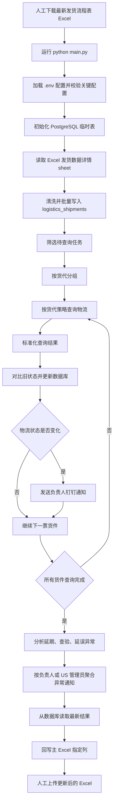
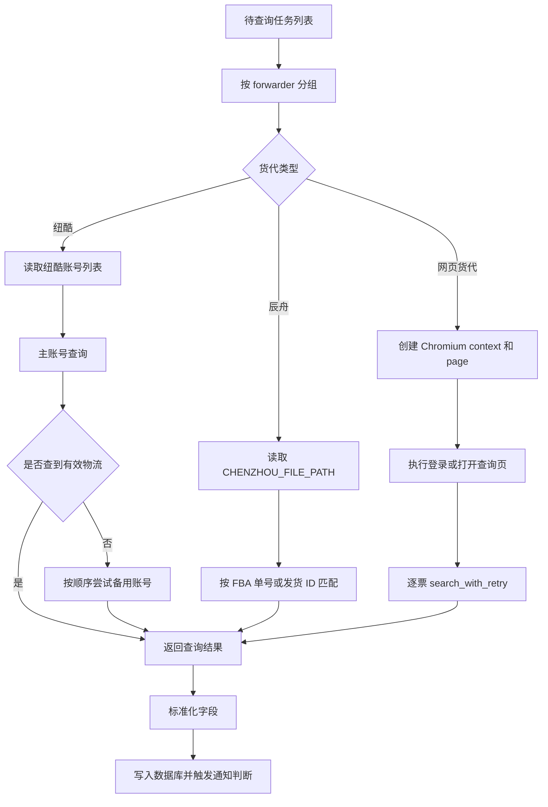
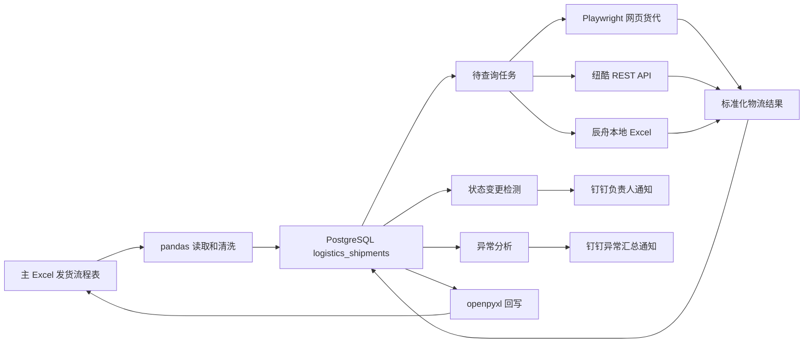
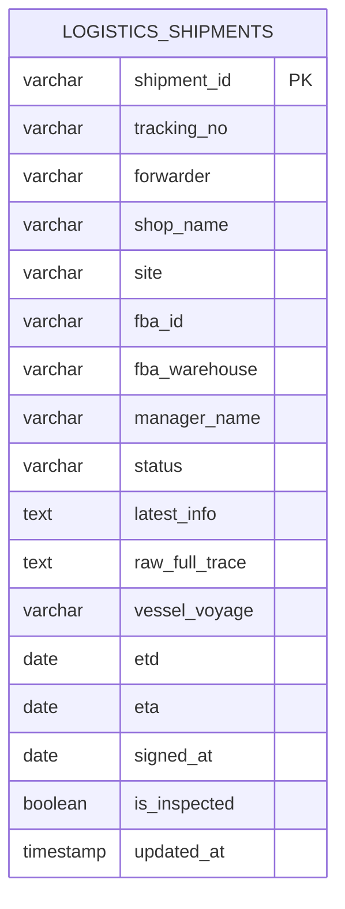
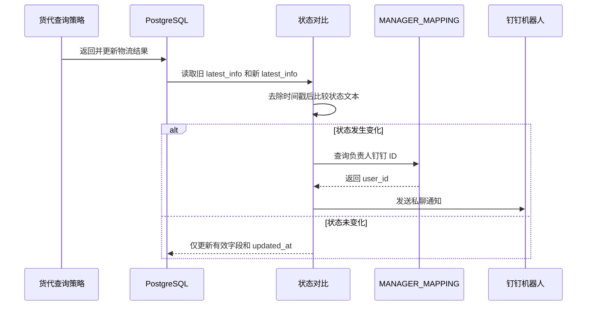

# 物流追踪自动化系统 PRD 与流程图

## 1. 文档信息

| 项目 | 内容 |
|------|------|
| 产品名称 | 物流追踪自动化系统 |
| 文档类型 | PRD（产品需求文档） |
| 当前版本 | v1.0 |
| 更新日期 | 2026-08-03 |
| 适用范围 | 主流程 `main.py` 及其依赖模块 |
| 不包含范围 | 钉钉桌面自动化、欧杰物流查询 |

## 2. 背景与问题

公司需要持续追踪跨境电商 Amazon FBA 货件的物流状态。当前货件数据以发货流程表 Excel 为主数据源，物流状态分散在不同货代系统、API 或本地货代表中。人工逐票查询效率低，且容易遗漏延期、查验、延误等异常。

本系统通过 Python 自动读取发货流程表，筛选待查询货件，按货代调用不同查询策略，更新 PostgreSQL 临时表，向负责人推送钉钉通知，并将最新状态回写到 Excel。

## 3. 产品目标

1. 自动查询未签收货件的最新物流状态，减少人工查询工作量。
2. 将物流关键字段标准化写入数据库和 Excel。
3. 当货件状态发生变化时，及时通知对应负责人。
4. 自动识别延期、查验、延误异常，并按负责人或 US 站管理员聚合推送。
5. 保持 Excel 为唯一主数据源，数据库仅作为单次运行的临时缓存。

## 4. 用户角色

| 角色 | 主要诉求 |
|------|----------|
| 物流运营人员 | 快速批量更新发货流程表中的物流状态 |
| 货件负责人 | 及时获知自己负责货件的状态变化和异常 |
| US 站点管理员 | 获取 US 站延期异常汇总 |
| 开发维护人员 | 维护货代爬虫、配置、字段映射和异常规则 |

## 5. 使用边界

### 5.1 范围内

- 从主 Excel 的 `发货数据详情` sheet 读取货件数据。
- 查询 8 类货代数据源：
  - 袋你飞
  - 海桥
  - 心达
  - 丛林鸟
  - 易派 / E-Express
  - 联宇 / 联宇物流
  - 纽酷
  - 辰舟
- 发送钉钉机器人私聊通知。
- 回写主 Excel 指定列。
- 记录控制台日志和 `logs/app.log`。

### 5.2 范围外

- 自动从钉钉群下载或上传 Excel。
- 欧杰物流查询。
- 长期历史数据分析。
- Web 管理后台。
- 多人并发编辑 Excel。

## 6. 总体流程图

## 7. 功能需求

### 7.1 配置加载与启动校验

系统启动时通过 `config.py` 加载 `.env` 配置。

必填配置：

| 类型 | 配置项 |
|------|--------|
| 数据库 | `DB_HOST`、`DB_PORT`、`DB_NAME`、`DB_USER`、`DB_PASSWORD` |
| 钉钉机器人 | `DINGTALK_APP_KEY`、`DINGTALK_APP_SECRET`、`DINGTALK_ROBOT_CODE` |
| Excel | `MAIN_EXCEL_PATH` |
| 本地货代表 | `CHENZHOU_FILE_PATH` |
| 通知路由 | `MANAGER_MAPPING`、`US_SITE_MANAGER` |
| 货代账号 | 各网页/API 货代对应账号密码 |

配置缺失或 JSON 格式错误时，系统应终止运行并输出明确错误。

### 7.2 Excel 数据导入

系统读取主 Excel 文件的 `发货数据详情` sheet，表头位于第 2 行，数据从第 3 行开始。

导入规则：

- `发货ID` 为空的行跳过。
- 空值、`NaN`、`NaT`、`None`、空字符串统一转换为空。
- `是否有被查验` 支持中文和英文布尔值解析。
- 每次运行会重建数据库临时表，Excel 是唯一主数据源。

### 7.3 数据库存储

系统使用 PostgreSQL 表 `logistics_shipments` 作为临时缓存。

核心字段：

| 字段 | 说明 |
|------|------|
| `shipment_id` | 发货 ID，主键 |
| `tracking_no` | 货运单号 |
| `forwarder` | 货代 |
| `shop_name` | 店铺 |
| `site` | 站点 |
| `fba_id` | FBA 货件编号 |
| `manager_name` | 负责人 |
| `status` | 当前状态 |
| `latest_info` | 最新物流备注 |
| `raw_full_trace` | 完整物流轨迹 |
| `vessel_voyage` | 船名航次 |
| `etd` | 开船或起飞日期 |
| `eta` | 到港时间 |
| `signed_at` | 妥投日期 |
| `is_inspected` | 是否查验 |
| `updated_at` | 更新时间 |

### 7.4 待查询任务筛选

系统只查询满足以下条件的货件：

- `tracking_no IS NOT NULL`
- `status != '签收' OR status IS NULL`
- `latest_info != 'Done' OR latest_info IS NULL`

已签收或已标记为 `Done` 的货件不再查询。

### 7.5 货代查询策略

| 货代 | 查询方式 | 关键说明 |
|------|----------|----------|
| 袋你飞 | Playwright 网页自动化 | 登录后进入状态追踪页面查询 |
| 海桥 | Playwright 网页自动化 | 登录时处理滑块验证 |
| 心达 | Playwright 网页自动化 | nextsls 平台，进入运单页面查询 |
| 丛林鸟 | Playwright 网页自动化 | nextsls 平台，处理弹窗后查询 |
| 易派 / E-Express | Playwright 网页自动化 | frameset 页面，公开查询 |
| 联宇 / 联宇物流 | Playwright 网页自动化 | 坤云平台，系统 SO 号查询 |
| 纽酷 | REST API | 主账号优先，备用账号顺序兜底，Token 缓存 24 小时 |
| 辰舟 | 本地 Excel | 通过本地表匹配 FBA 或发货 ID，黄色单元格判断妥投 |

### 7.6 货代调度流程图

### 7.7 查询结果标准化

所有查询策略应返回统一字段：

| 字段 | 说明 |
|------|------|
| `trace` | 完整物流轨迹 |
| `latest_info` | 最新物流状态 |
| `voyage_info` | 船名航次 |
| `sail_time` | 开船或起飞时间 |
| `arrive_time` | 到港时间 |
| `sign_time` | 签收或妥投时间 |
| `is_inspected` | 是否查验 |
| `status` | `在途` 或 `签收` |

如果已签收，`status` 写为 `签收`，`latest_info` 写为 `Done`。

### 7.8 状态变更通知

每票货件查询完成后，系统读取数据库中旧的 `latest_info`，与本次返回的新 `latest_info` 对比。

对比规则：

- 以 `————` 为分隔符，取第一段状态文本。
- 新旧第一段不同且新值不为空，判定为状态变更。
- 状态变更时，通过 `MANAGER_MAPPING` 找到负责人钉钉 ID 并发送私聊。
- 找不到负责人钉钉 ID 时，记录 warning 日志，不中断主流程。

### 7.9 异常分析与汇总通知

爬虫查询完成后，系统对未签收货件执行异常检测。

| 异常类型 | 判定条件 | 通知对象 |
|----------|----------|----------|
| 延期 | 当前日期 - `eta` > 5 天 | US 站发给 `US_SITE_MANAGER`，其他站按负责人发送 |
| 查验 | `is_inspected == True` | 按负责人发送 |
| 延误 | `latest_info` 包含 `延误`、`延迟`、`延至` | 按负责人发送 |

### 7.10 数据回写 Excel

系统从数据库读取最新结果，并回写主 Excel 的固定列。

| Excel 列 | 写入字段 | 说明 |
|----------|----------|------|
| AY | `etd` | 开船/起飞日期 ETD |
| AZ | `signed_at` | 妥投日期 |
| BC | `status` | 货件在途状态 |
| BD | `latest_info` | 货件状态备注 |
| BE | `eta` | 到港时间 ETA |
| BL | `vessel_voyage` | 船名航次 |
| BG | `is_inspected` | 是否被查验 |

## 8. 数据流图

## 9. 数据库结构图

## 10. 通知流程图

## 11. 日志与可观测性

系统运行时应同时输出控制台日志和 `logs/app.log`。

关键日志内容：

- 每组货代的任务数量。
- 每票货件的发货 ID、运单号、店铺、负责人。
- 完整轨迹、最新轨迹、船名航次、ETD、ETA、签收时间、查验标记。
- 新旧状态对比结果。
- 实际发生变化的字段。
- 钉钉通知接收人和通知内容。
- 查询失败、配置缺失、负责人映射缺失等异常。

## 12. 非功能需求

| 类型 | 需求 |
|------|------|
| 可维护性 | 新增货代时应通过新增 `spiders/*.py` 并注册 `SPIDER_FACTORY` 完成 |
| 稳定性 | 网页查询应使用 `search_with_retry`，默认最多重试 3 次 |
| 可追踪性 | 每票查询结果必须有日志记录 |
| 安全性 | `.env` 不提交仓库，账号密码、Token、钉钉凭证只保存在本地配置中 |
| 数据一致性 | Excel 是唯一主数据源，数据库每次运行重建 |
| 可扩展性 | 查询结果必须遵循统一字段结构，便于数据库更新和 Excel 回写 |

## 13. 验收标准

1. 程序能读取主 Excel 并成功写入 `logistics_shipments`。
2. 程序只查询未签收且有货运单号、未标记 `Done` 的货件。
3. 支持 8 类货代数据源，并能按货代正确分流。
4. 每票成功查询结果能写入数据库对应字段。
5. 状态变化时，能按负责人发送钉钉私聊。
6. 延期、查验、延误异常能被识别并聚合推送。
7. 数据库结果能回写到主 Excel 的 AY、AZ、BC、BD、BE、BL、BG 列。
8. 运行结束后，日志中能追踪每票货件的查询、对比、通知和写入结果。

## 14. 风险与约束

| 风险 | 影响 | 应对方式 |
|------|------|----------|
| 货代网页结构变化 | Playwright 定位失效 | 按货代单独维护爬虫文件 |
| 滑块验证码变化 | 海桥登录失败 | 保留独立登录逻辑和日志 |
| 纽酷账号查不到物流 | 查询结果为空 | 主账号失败后按备用账号兜底 |
| 负责人映射缺失 | 无法发送私聊 | 记录 warning，并维护 `.env` 的 `MANAGER_MAPPING` |
| Excel 列名或列位置变化 | 导入或回写失败 | 同步调整字段映射和回写列配置 |
| 数据库重建 | 不保留历史 | 明确数据库仅为临时缓存 |

## 15. 后续优化方向

1. 将 Excel 回写列映射配置化，降低主表列变化带来的维护成本。
2. 为更多货代解析逻辑补充单元测试。
3. 将 `main.py` 的流程编排拆分为更小的 service 模块。
4. 增加运行汇总报告，例如总任务数、成功数、失败数、通知数。
5. 增加失败任务重跑能力，避免单次异常影响整批更新。
